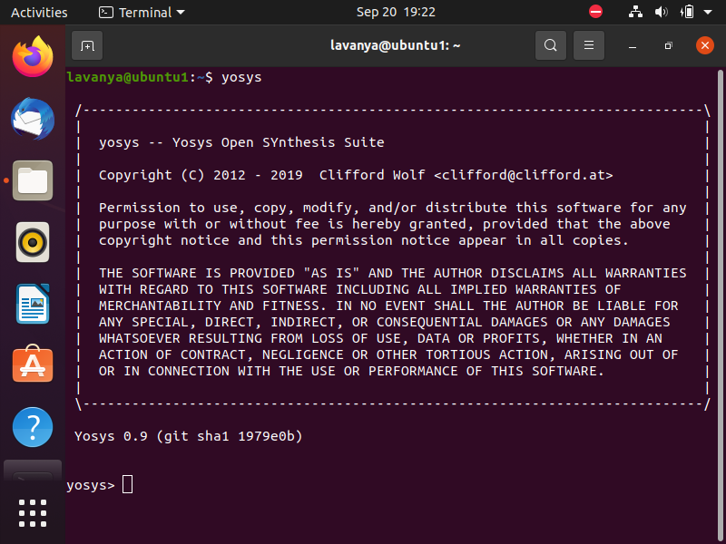
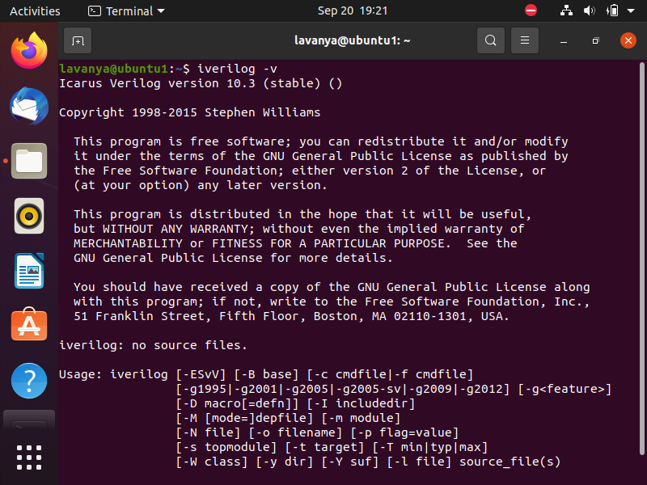
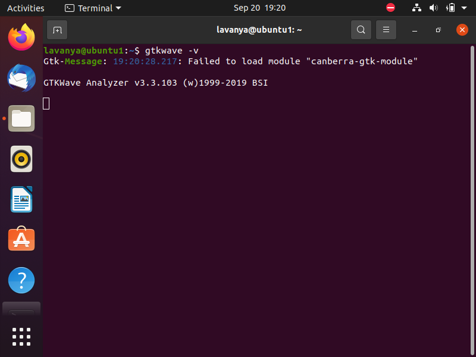

# RISC-V Reference SoC Tapeout Program VSD


## Tools Installation
The complete installation guide for the required tools is available here:

## System Requirements

| Component   | Requirement            |
|-------------|------------------------|
| **RAM**     | 6 GB or more           |
| **Disk**    | 50 GB free             |
| **OS**      | Ubuntu 20.04 or newer  |
| **CPU**     | 4 virtual CPUs         |

## Tool check

## Yosys Installation on Ubuntu

To install Yosys, run the following commands in your terminal:

```bash
sudo apt-get update

# Clone the Yosys repository
git clone https://github.com/YosysHQ/yosys.git
cd yosys

# Install make if not already installed
sudo apt install make

# Install required dependencies
sudo apt-get install build-essential clang bison flex \
 libreadline-dev gawk tcl-dev libffi-dev git \
 graphviz xdot pkg-config python3 libboost-system-dev \
 libboost-python-dev libboost-filesystem-dev zlib1g-dev

# Configure, build, and install Yosys
make config-gcc
make
sudo make install

```


## Installing Icarus Verilog (Iverilog) on Ubuntu

To install Iverilog, run the following commands in your terminal:

```bash
# Update package lists
sudo apt-get update

# Install Iverilog
sudo apt-get install iverilog -y
```


## Installing GTKWave on Ubuntu

To install GTKWave, run the following commands in your terminal:

```bash
# Update package lists
sudo apt-get update

# Install GTKWave
sudo apt install gtkwave -y

```


